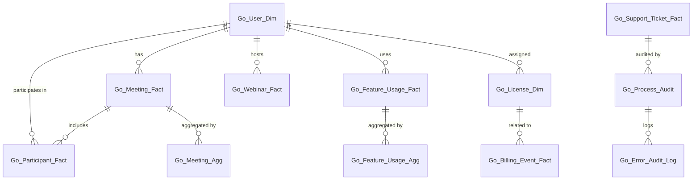

# Metadata
**Author:** AAVA
**Version:** 1
**Description:** Comprehensive Gold Layer Logical Data Model for Zoom Platform Analytics System. This model supports Platform Usage & Adoption, Service Reliability & Support, and Revenue & License Management domains. It includes facts, dimensions, aggregate tables, process audit, and error tracking structures, with SCD types, metadata columns, and table relationships.

---

# 1. Gold Layer Logical Model

| Table Name              | Type        | SCD Type | Column Name                | Data Type    | PII Classification | Column Description |
|------------------------|-------------|----------|----------------------------|--------------|--------------------|-------------------|
| Go_User_Dim            | Dimension   | SCD2     | User_Name                  | String       | Yes                | User's display name |
|                        |             |          | Email                      | String       | Yes                | User's email address |
|                        |             |          | Company                    | String       | No                 | User's company name |
|                        |             |          | Plan_Type                  | String       | No                 | Subscription plan type |
|                        |             |          | load_date                  | DateTime     | No                 | Data load timestamp |
|                        |             |          | update_date                | DateTime     | No                 | Last update timestamp |
|                        |             |          | source_system              | String       | No                 | Source system name |
| Go_Meeting_Fact        | Fact        | N/A      | Meeting_Topic              | String       | No                 | Meeting topic/title |
|                        |             |          | Start_Time                 | DateTime     | No                 | Meeting start time |
|                        |             |          | End_Time                   | DateTime     | No                 | Meeting end time |
|                        |             |          | Duration_Minutes           | Integer      | No                 | Meeting duration in minutes |
|                        |             |          | load_date                  | DateTime     | No                 | Data load timestamp |
|                        |             |          | update_date                | DateTime     | No                 | Last update timestamp |
|                        |             |          | source_system              | String       | No                 | Source system name |
| Go_Participant_Fact    | Fact        | N/A      | User_Name                  | String       | Yes                | Participant's name |
|                        |             |          | Meeting_Topic              | String       | No                 | Meeting topic/title |
|                        |             |          | Join_Time                  | DateTime     | No                 | Participant join time |
|                        |             |          | Leave_Time                 | DateTime     | No                 | Participant leave time |
|                        |             |          | load_date                  | DateTime     | No                 | Data load timestamp |
|                        |             |          | update_date                | DateTime     | No                 | Last update timestamp |
|                        |             |          | source_system              | String       | No                 | Source system name |
| Go_Feature_Usage_Fact  | Fact        | N/A      | Feature_Name               | String       | No                 | Name of feature used |
|                        |             |          | Usage_Count                | Integer      | No                 | Number of times feature used |
|                        |             |          | Usage_Date                 | DateTime     | No                 | Date of feature usage |
|                        |             |          | load_date                  | DateTime     | No                 | Data load timestamp |
|                        |             |          | update_date                | DateTime     | No                 | Last update timestamp |
|                        |             |          | source_system              | String       | No                 | Source system name |
| Go_Webinar_Fact        | Fact        | N/A      | Webinar_Topic              | String       | No                 | Webinar topic/title |
|                        |             |          | Start_Time                 | DateTime     | No                 | Webinar start time |
|                        |             |          | End_Time                   | DateTime     | No                 | Webinar end time |
|                        |             |          | Registrants                | Integer      | No                 | Number of registrants |
|                        |             |          | load_date                  | DateTime     | No                 | Data load timestamp |
|                        |             |          | update_date                | DateTime     | No                 | Last update timestamp |
|                        |             |          | source_system              | String       | No                 | Source system name |
| Go_Support_Ticket_Fact | Fact        | N/A      | Ticket_Type                | String       | No                 | Type of support ticket |
|                        |             |          | Resolution_Status          | String       | No                 | Ticket resolution status |
|                        |             |          | Open_Date                  | DateTime     | No                 | Ticket open date |
|                        |             |          | load_date                  | DateTime     | No                 | Data load timestamp |
|                        |             |          | update_date                | DateTime     | No                 | Last update timestamp |
|                        |             |          | source_system              | String       | No                 | Source system name |
| Go_License_Dim         | Dimension   | SCD2     | License_Type               | String       | No                 | Type of license |
|                        |             |          | Start_Date                 | DateTime     | No                 | License start date |
|                        |             |          | End_Date                   | DateTime     | No                 | License end date |
|                        |             |          | load_date                  | DateTime     | No                 | Data load timestamp |
|                        |             |          | update_date                | DateTime     | No                 | Last update timestamp |
|                        |             |          | source_system              | String       | No                 | Source system name |
| Go_Billing_Event_Fact  | Fact        | N/A      | Event_Type                 | String       | No                 | Type of billing event |
|                        |             |          | Amount                     | Decimal      | No                 | Billing amount |
|                        |             |          | Event_Date                 | DateTime     | No                 | Billing event date |
|                        |             |          | load_date                  | DateTime     | No                 | Data load timestamp |
|                        |             |          | update_date                | DateTime     | No                 | Last update timestamp |
|                        |             |          | source_system              | String       | No                 | Source system name |
| Go_Meeting_Agg         | Aggregate   | N/A      | Company                    | String       | No                 | Company name |
|                        |             |          | Plan_Type                  | String       | No                 | Subscription plan type |
|                        |             |          | Total_Meetings             | Integer      | No                 | Total meetings held |
|                        |             |          | Total_Duration_Minutes     | Integer      | No                 | Total meeting duration |
|                        |             |          | load_date                  | DateTime     | No                 | Data load timestamp |
|                        |             |          | update_date                | DateTime     | No                 | Last update timestamp |
|                        |             |          | source_system              | String       | No                 | Source system name |
| Go_Feature_Usage_Agg   | Aggregate   | N/A      | Feature_Name               | String       | No                 | Name of feature |
|                        |             |          | Usage_Date                 | DateTime     | No                 | Date of usage |
|                        |             |          | Total_Usage_Count          | Integer      | No                 | Total usage count |
|                        |             |          | load_date                  | DateTime     | No                 | Data load timestamp |
|                        |             |          | update_date                | DateTime     | No                 | Last update timestamp |
|                        |             |          | source_system              | String       | No                 | Source system name |
| Go_Process_Audit       | Code Table  | N/A      | Process_Name               | String       | No                 | Name of ETL/data pipeline process |
|                        |             |          | Execution_Timestamp        | DateTime     | No                 | Process execution timestamp |
|                        |             |          | Status                     | String       | No                 | Execution status (Success/Fail) |
|                        |             |          | Records_Processed          | Integer      | No                 | Number of records processed |
|                        |             |          | load_date                  | DateTime     | No                 | Data load timestamp |
|                        |             |          | update_date                | DateTime     | No                 | Last update timestamp |
|                        |             |          | source_system              | String       | No                 | Source system name |
| Go_Error_Audit_Log     | Code Table  | N/A      | Error_Type                 | String       | No                 | Type of error encountered |
|                        |             |          | Error_Message              | String       | No                 | Error message details |
|                        |             |          | Error_Timestamp            | DateTime     | No                 | Error occurrence timestamp |
|                        |             |          | Process_Name               | String       | No                 | Name of process where error occurred |
|                        |             |          | load_date                  | DateTime     | No                 | Data load timestamp |
|                        |             |          | update_date                | DateTime     | No                 | Last update timestamp |
|                        |             |          | source_system              | String       | No                 | Source system name |

---

# 2. Conceptual Data Model Diagram (Tabular)

| Domain                        | Entity/Table           | Description |
|-------------------------------|------------------------|-------------|
| Platform Usage & Adoption     | Go_User_Dim            | User profile and attributes |
|                               | Go_Meeting_Fact        | Meeting session details |
|                               | Go_Participant_Fact    | Meeting participation details |
|                               | Go_Feature_Usage_Fact  | Feature usage events |
|                               | Go_Webinar_Fact        | Webinar session details |
|                               | Go_Meeting_Agg         | Meeting aggregates by company/plan |
|                               | Go_Feature_Usage_Agg   | Feature usage aggregates |
| Service Reliability & Support | Go_Support_Ticket_Fact | Support ticket events |
|                               | Go_Process_Audit       | ETL/process audit details |
|                               | Go_Error_Audit_Log     | Error and validation logs |
| Revenue & License Management  | Go_License_Dim         | License assignment details |
|                               | Go_Billing_Event_Fact  | Billing transaction events |

---

# 3. ER Diagram (Graphical Visualization)

---

# 4. apiCost

apiCost: 0.0
